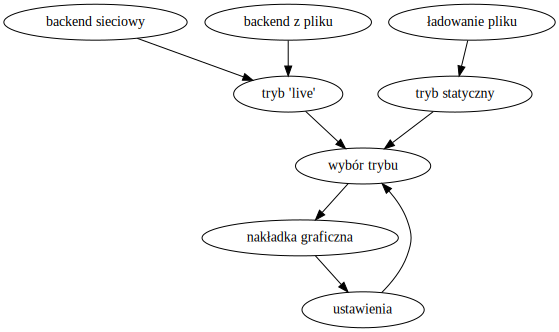

# Struktura aplikacji wizualizującej dane

## Założenia projektu:

Celem projektu jest wizualizacja danych zbieranych w czasie jazdy przez Datalogger, oraz wyświetlanie na żywo danych odbieranych z serwera telemetrii. Podstawowymi założeniami projektu są:
- Analiza i przetwarzanie danych zebranych podczas jazdy w formie statycznych wykresów z możliwością przeglądania, przesuwania oraz zbliżania poszczególnych obszarów
- Odbieranie z serwera HTTP danych telemetrycznych za pomocą HTTP-GET i wyświetlanie ich w trybie 'live'
- Odtwarzanie na żywo danych zebranych przez Datalogger w czasie rzeczywistym w trybie 'live' 
- Kompatybilność z systemami operacyjnymi Windows oraz Linux

## Wybór technologii wykonania:

Językiem programowania wybranym do tego projektu będzie C++. Zewnętrzne biblioteki użyte w programie będą musiały być kompatybilne z systemami Windows oraz Linux, w związku z czym użyta zostanie biblioteka POCO do celów sieciowych i wxWidgets jako biblioteka graficzna. 

## Struktura programu:

Program dzielić się będzie na dwie zasadnicze części komunikujące się ze sobą- backend oraz frontend, odpowiadające kolejno za agregowanie oraz wyświetlanie danych. Interakcja z użytkownikiem będzie w całości zamknięta we frontendzie, poza sekcją ustawień bezpośrednio wpływającą na backend.



## Proof of Concept:
Znalezienie prawdziwie multiplatformowego rozwiązania problemu komunikacji z serwerem oznaczało testowanie kilku bibliotek w obu wymaganych systemach operacyjnych. Rozwiązaniem okazało się być POCO, które pozwoliło niewielką ilością kodu stworzyć prostą klasę do wysyłania zapytań pod dany adres.

Zawartość pliku <i>http_client.cpp</i> zawierającego opis metod klasy http_client:


```C++
http_client::http_client(string address, int port)
{
		this->session = new HTTPClientSession(address,port);
}

http_client::~http_client()
{
	delete this->session;
}

string http_client::send_request(bool verbose)
{
		string path = "/";
		HTTPRequest req(HTTPRequest::HTTP_GET, path, HTTPMessage::HTTP_1_1);
		this->session->sendRequest(req);

		HTTPResponse res;
		if(verbose) cout << res.getStatus() << " " << res.getReason() << endl;
		istream &is = this->session->receiveResponse(res);
		std::ostringstream oss;
		StreamCopier::copyStream(is, oss);
		return oss.str();
}
```

Stworzenie elementu tej klasy oraz wywołanie funkcji <i>send_request()</i> daje następujące rezultaty:

```Bash
[czarnobylu@zeus POC]$ g++ *.cpp -o main -lPocoUtil -lPocoXML -lPocoJSON -lPocoNet -lPocoFoundation && ./main 
200 OK
123
[czarnobylu@zeus POC]$ 
```

W aplikacji końcowej odpowiedź "123" zastąpiona byłaby np. plikiem CSS z najnowszymi danymi 
